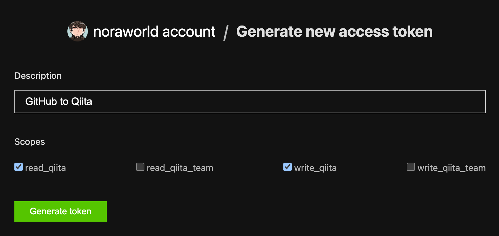
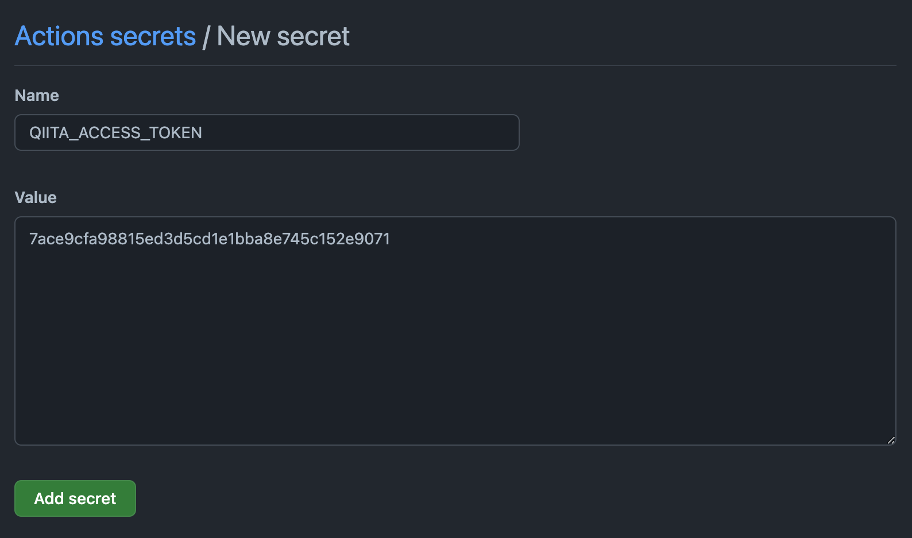

# GitHub-to-Qiita
GitHub-to-Qiita lets you integrate your Qiita articles with your GitHub repository. Setting up GitHub-to-Qiita and pushing your articles into your GitHub repository, they will be published to [Qiita](https://qiita.com) automatically.

Make your writing efficient and save your time with GitHub-to-Qiita! 😉


## Setup
The setup is easy. You can setup a workflow by following the instructions below.

### Generate a Qiita access token
Navigate to [the Qiita access token generation page](https://qiita.com/settings/tokens/new).



Enter the following information, and click the `Generate token` button.

| Key         | Description                                                                                 | Fixed | Sample or Fixed Value          |
| ----------- | ------------------------------------------------------------------------------------------- | ----- | ------------------------------ |
| Description | Specify a description so you are easy to understand for what the access token is used later | false | `GitHub to Qiita`              |
| Scopes      | Specify scopes that describe what privilege the access token has                            | true  | `read_qiita` and `write_qiita` |

After generating your new access token, it should be going to appear on your screen. Then copy it. Note that it can be shown only once. If you lose it, regenerate it again.


**WARNING:** The above screen shot shows a dummy access token, not a real access token. You should not take a screen shot including your access token, and must not share it with other people. Please be careful.

### Set your Qiita access token to your repository
Navigate to the Actions secrets creation page, which is accessible at `https://github.com/<USERNAME>/<REPONAME>/settings/secrets/actions/new`.



Enter the following information, and click the `Add secret` button.

| Key   | Description                                                               | Sample Value                                                    |
| ----- | ------------------------------------------------------------------------- | --------------------------------------------------------------- |
| Name  | Specify your secret environment variable name for your Qiita access token | `QIITA_ACCESS_TOKEN`                                            |
| Value | Specify your Qiita access token                                           | `7ace9cfa98815ed3d5cd1e1bba8e745c152e9071` (THIS IS A SAMPLE!!) |

### Create a workflow file
Create a file as `.github/workflows/qiita.yml`, and set your own workflow.

Here is a sample workflow.

```yaml
# .github/workflows/qiita.yml

name: "GitHub to Qiita"

on:
  push:
    branches: [ main ]

jobs:
  qiita:
    runs-on: ubuntu-latest
    steps:
      - name: "Publish to Qiita"
        uses: noraworld/github-to-qiita@v0.1.0
        with:
          dir: "articles"
          qiita_access_token: ${{ secrets.QIITA_ACCESS_TOKEN }}
```

Replace a part of the above YAML code with the following.

| Key                                           | Description                                                                              | Required | Sample or Default Value             |
| --------------------------------------------- | ---------------------------------------------------------------------------------------- | -------- | ----------------------------------- |
| `jobs.qiita.steps[*].with.dir`                | Specify a directory in which files you want to track and publish to Qiita                | true     | `articles`                          |
| `jobs.qiita.steps[*].with.qiita_access_token` | Specify your Qiita access token (accessible by `${{ secrets.QIITA_ACCESS_TOKEN }}` [^1]) | true     | `${{ secrets.QIITA_ACCESS_TOKEN }}` |
| `jobs.qiita.steps[*].with.mapping_filepath`   | Specify any file path in which you want to put the mapping file                          | false    | `mapping.txt`                       |

[^1]: Only in case you set the secret environment variable name as `QIITA_ACCESS_TOKEN` at the previous step.

**WARNING:** Please do not set the version to `@main` at the `jobs.qiita.steps[*].uses` section for a production use because the specification is subject to change, and the latest codes potentially contain bugs. It is highly recommended to set the latest tagged version, which can be accessible at the [Tags page](/../../tags).

---

That’s all!


## How it works
Pushing your articles in the specific directory (`articles` directory in the sample workflow above) into the specific branch (`main` branch in the sample workflow above), it starts to work automatically. There is no need to do the further operation.

You can see whether your workflow succeeded at `https://github.com/<USERNAME>/<REPONAME>/actions/workflows/qiita.yml`.


## How to contribute
The files and directories for a local development are as follow.

* `.env`
* `mapping.txt`
* `articles/`

These are ignored for Git (described in `.gitignore`), so you can create sample data and use them to test how it works.

**WARNING:** The `published` key in a YAML header in a sample article (files in `articles/`) should be always set to `false`, or your sample article will be exposed publicly!

```yaml
---
title: "Test"
topics: ["Foo", "Bar", "Baz"]
published: false # <= IMPORTANT!!!
---

# Test
This is a test article.
```

### Environment variables
You need to set the following environment variables for a local debug.

Here is a sample `.env` file.

```ruby
ADDED_FILES="articles/test01.md"
MODIFIED_FILES="articles/test02.md"
MAPPING_FILEPATH="mapping.txt"
QIITA_ACCESS_TOKEN="7f6c7aec310ded84ae3acfe8f920cb1c7556c7d3" # THIS IS A SAMPLE!!
```

| Environment Variable Name | Description                                                | Required |
| ------------------------- | ---------------------------------------------------------- | -------- |
| `ADDED_FILES`             | Paths of articles that will be published newly             | false    |
| `MODIFIED_FILES`          | Paths of articles that will be modified                    | false    |
| `MAPPING_FILEPATH`        | A filepath to which file it writes the mapping information | true     |
| `QIITA_ACCESS_TOKEN`      | Your Qiita access token (for development)                  | true     |

**NOTE:** It is highly recommended to use the Qiita access token that is different from one for a production use.

You can omit either `ADDED_FILES` or `MODIFIED_FILES`, but if both are omitted, it does nothing.


## Notice
The old implementation has moved to [noraworld/github-to-qiita-server](https://github.com/noraworld/github-to-qiita-server), and it is no longer maintained.


## License
All codes of this repository are available under the MIT license. See the [LICENSE](/LICENSE) for more information.
